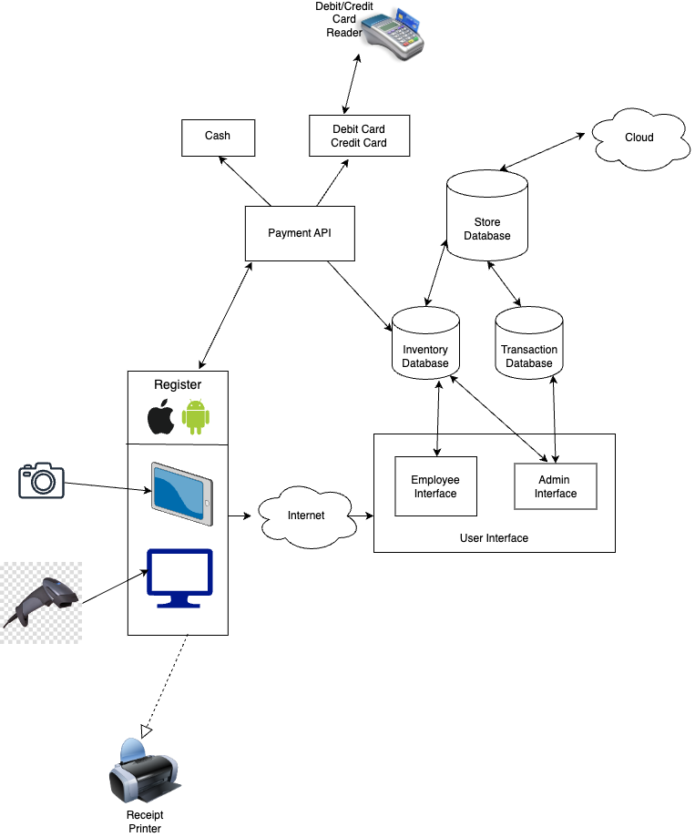
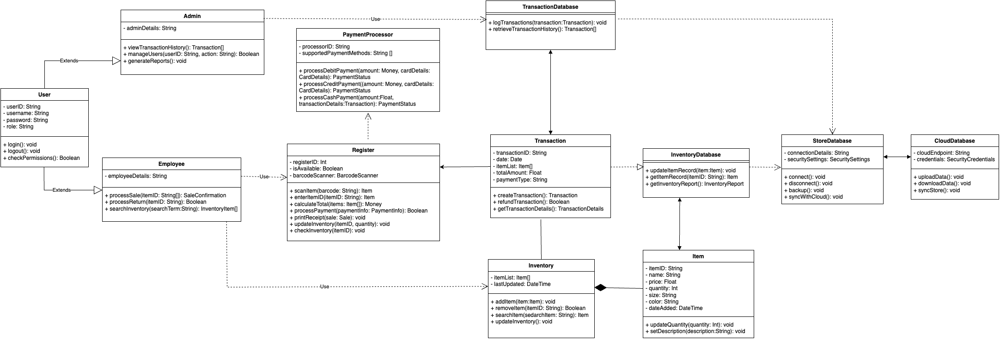

# Clothing Store Point of Sale System

Prepared by: Steven Pun, Jared Robles, and Tammy Dahl

### System Description

The Clothing Store Point of Sale (POS) System is designed to facilitate smooth and efficient retail operations for both employees and management. 
The versatile software can be accessed via store registers and portable devices with connectivity to the admin or employee interfaces, depending on user roles. 
The system centralizes transaction data and inventory management, offering real-time updates and synchronization across multiple store locations via cloud-based services. It also integrates payment processing for various methods, including cards and cash, alongside essential sales functions such as barcode scanning and receipt printing. This system streamlines in-store processes, ensuring operational efficiency and enhanced customer service.

### Software Architecture Diagram

### Software Architecture Diagram Description

The Point of Sale System for the clothing store is designed to make sales efficient and organized for employees. The software can be accessed through store registers as well as phones and tablets with Apple or Android operating systems.  These devices must first be connected to the internet, which will allow the user to access either an admin interface (for managers) or an employee interface. The admin interface allows the user to access the transaction database, which contains all the transaction history and data. Admin and regular employees can both access the inventory database, which they can update and search. These two databases make up the store database that is backed up by a cloud system, synchronizing data across different store locations. The inventory database is automatically updated through the Payment API, which handles payment from debit and credit cards, as well as cash. Credit and debit cards are processed through card readers. Employees are also able to scan items through barcode scanners. The items will then be visible on the device being used. After payment is processed, the transaction information will be printed out through a receipt printer.

### UML Class Diagram

### UML Class Diagram Description

This UML diagram effectively visualizes the structure of a clothing store POS software system, outlining the relationships between users, transactions, payments, inventory, and data storage, both locally and in the cloud.

- _**Connections**_

Solid lines represent associations, showing how instances of one class are connected to instances of another, indicating relationships or collaboration between classes.

Dashed lines represent dependencies, indicating that a class uses another class in some capacity, but not necessarily holding a reference to it.

- _**User (Abstract Class)**_

Represents a generic user in the system, serving as a base class for more specific types of users.

**Attributes**:

userID: String - A unique identifier for the user.

username: String - The user's login name.

password: String - The user's password for authentication.

role: String - The role of the user within the system, e.g., Admin or Employee.

**Operations**:

login(): void - A method for the user to log into the system.

logout(): void - A method for the user to log out of the system.

checkPermissions(): Boolean - A method to check if the user has the permissions to perform a certain operation.

- _**Admin (Extends User)**_

A specialized type of User with administrative privileges.

**Attributes**:
Inherits all attributes from User.

**Operations**:
viewTransactionHistory(): Transaction[] - Allows the admin to view the history of all transactions.

manageUsers(userID: String, action: String): Boolean - Enables the admin to manage users, including actions like create, update, or delete.

generateReport(): void - Allows the admin to generate different types of reports.

- _**Employee (Extends User)**_

A specialized type of User who handles daily transactions and inventory management.

**Attributes**:

Inherits all attributes from User.

**Operations**:

processSale(itemIDs: String[]): SaleConfirmation - Processes the sale of items and returns a sale confirmation.

processReturn(itemID: String): Boolean - Processes the return of an item and indicates success with a boolean.

searchInventory(searchTerm: String): InventoryItem[] - Searches the inventory with a given term and returns a list of items.

- _**Register**_

The point of interaction for processing sales and managing payments.

**Attributes**:

registerID: Int - A unique identifier for the register.

isAvailable: Boolean - Indicates if the register is available for use.

barcodeScanner: BarcodeScanner - An associated barcode scanner for inputting item data.

**Operations**:

scanItem(barcode: String): Item - Scans an item's barcode and retrieves the item details.

enterItemID(itemID: String): Item - Manually enters an item's ID and retrieves the item details.

calculateTotal(items: Item[]): Money - Calculates the total cost of items including taxes.

processPayment(paymentInfo: PaymentInfo): Boolean - Processes the payment and returns success status.

printReceipt(sale: Sale): void - Prints a receipt for the completed sale.

updateInventory(item: Item, quantity: Int): void - Updates the inventory based on the sale or return.

checkInventory(itemID: String): void - Checks the inventory level of a specific item.

- _**PaymentProcessor**_

Handles the processing of various types of payments, interfacing with external payment systems as necessary.

**Attributes**:

processorID (String): A unique identifier for the payment processor, which may be used to track transactions or configure processor settings.

supportedPaymentMethods (String[]): An array of strings representing the different payment methods supported by this processor (e.g., "debit", "credit", "cash").

**Operations**:

processDebitPayment(amount: Money, cardDetails: CardDetails): PaymentStatus - Processes a payment made by a debit card. The amount is a Money object representing the value of the transaction. cardDetails is a CardDetails object containing information such as card number, expiry date, and CVV. The method communicates with a bank or payment gateway to complete the transaction and returns a PaymentStatus object indicating the result of the operation.

processCreditPayment(amount: Money, cardDetails: CardDetails): PaymentStatus - Processes a payment made by a credit card. It uses the same parameter types as processDebitPayment and performs a similar action but may involve different processing rules or checks specific to credit transactions, such as pre-authorization or credit checks. It returns a PaymentStatus object that details the outcome of the credit payment.

processCashPayment(amount: Float, transactionDetails: Transaction): PaymentStatus - Records the details of a transaction paid with cash. While no electronic authorization is required, this method logs the transaction for record-keeping, ensuring cash payments are accounted for within the system. The amount is the cash received, and transactionDetails includes data such as transaction ID and items involved. The method returns a PaymentStatus that would typically indicate a successful recording of the transaction.

- _**TransactionDatabase**_

Stores and manages the transaction records.

**Operations:**

logTransactions(): Records new transactions in the database.

retrieveTransactionHistory(): Retrieves the history of transactions.

- _**Transaction**_

Represents a single financial transaction.

**Attributes:**

transactionID: String - A unique identifier for the transaction.

date: Date - The date the transaction took place.

itemList: Item[] - The list of items involved in the transaction.

totalAmount: Float - The total amount of the transaction.

paymentType: String - The method of payment used.

**Operations:**

createTransaction(), refundTransaction(), getTransactionDetails() - Creates a new transaction, processes a refund, and retrieves details of transactions.

- _**InventoryDatabase**_

Manages the storage and retrieval of inventory records.

**Operations:**

updateItemRecord(), getItemRecord(), getInventoryReport() - Updates an item record, retrieves an item's record, and generates an inventory report.

- _**Inventory**_

Represents the collection of all items available for sale.

**Attributes:**

itemList: Item[] - A list of all items in the inventory.

lastUpdated: DateTime - The last time the inventory was updated.

**Operations:**

addItem(), removeItem(), searchItem(), updateInventory() - Adds a new item, removes an item, searches for items, and updates the inventory.

- _**Item**_

Represents an individual item in the inventory.

**Attributes:**

itemID: String - A unique identifier for the item.

name: String - The name of the item.

price: Float - The price of the item.

quantity: Int - The quantity of the item available.

size: String - The size of the item.

color: String - The color of the item.

dateAdded: DateTime - The date the item was added to the inventory.

**Operations:**
updateQuantity(), setDescription() - Updates the quantity of an item and sets its description.

- _**StoreDatabase**_

Represents the local database where store-related data are kept.

**Attributes:**

connectionDetails: String - Information required to establish a connection to the database.

securitySettings - The settings to ensure secure access and data storage.

**Operations:**

connect(), disconnect(), backup(), syncWithCloud() - Connects to, disconnects from, backs up, and synchronizes the database with the cloud.

- _**CloudDatabase**_

Overview: Represents the cloud-based service used for data backup and synchronization.

**Attributes:**

cloudEndpoint: String - The endpoint for connecting to the cloud service.

credentials - Authentication credentials for accessing the cloud service.

**Operations:**

uploadData(), downloadData(), syncStore() - Uploads data to, downloads data from, and synchronizes the store's data with the cloud.
Development plan and timeline

### Development plan and timeline

For this project, with building the interface as well as testing all of the functionalities, we anticipate that this project will take about 15 months to complete.

First, the software engineering team should develop the initial page that the employees interact with. The front-end developers would work on a system that the employees and admins would be able to see and interact with. The different functions that would be expected from them are creating a page for employees to log into the system, clock in for their shifts, and altering information about the clothing stock. On this page, the employees would be able to complete customer purchases, process returns as well as having a function to be able to sort through the different filters to categorize the clothing and make checking customers out easier. We anticipate that this development will take around 3-4 months.

On the other side of the program, the backend developers would work on creating the system that supports what the employees are interacting with. Here, the backend developers would make sure that the system is connected to the internet, running on multiple different servers, making sure that the system is secure and does not allow anybody without proper permissions to enter the system, as well as making sure that everything is backed up and makes it so that the system would not need maintenance during operational hours. A trivial part of the system would be the server that stores information about the clothing and should be able to keep information about every item, including the size, color, ID number, price, quantity of the item, date added, etc. This is to ensure that the employees can categorize each item while being able to filter through them while checking customers out. The system should have a third-party API that would connect to external services allowing the company to process payments through Apple Pay, other digital wallets, as well as various debit and credit cards. The backend developers would also be responsible for making sure that the inventory count is accounted for and for making sure that the items are properly tracked for when sales and refunds are made. We expect that this process will take around 8 months to complete.

Finally, the testing phase would be where the product is tested. We want to try and test every possible scenario with different items and variations to get a true understanding of what may be seen as an issue and what needs to be improved on. This would require both the front-end and back-end developers to test every possible scenario and report back to ensure that the program doesn’t have any outstanding bugs and can fix any issues that present themselves during this testing phase. This phase should take around 3 months to ensure that everything is working properly and satisfies all needs. 
